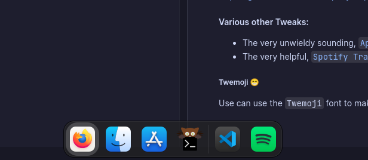
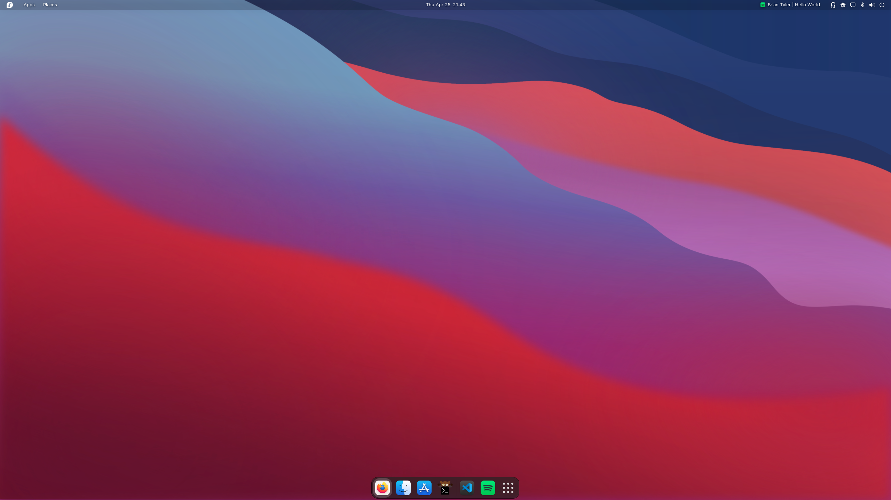

+++
title = "OS Setup"
date = 2024-04-29
draft = false

[taxonomies]
categories = ["Linux"]
tags = ["linux"]
[extra]
keywords = "fedora, pop os, linux, development, operating system, programming setup"
series = "linux"
+++

In this series, I detail my Linux setup and how it has progressed to give me my best development environment possible. I will be detailing my setup for Fedora and Pop!_OS, as well as any other distributions I may try in the future. I will also be providing some hints on how to make your own setup.

## Pre-historic Linux 🦖
Originally I choose my Linux distro based upon most popular which at the time (2019) was **Ubuntu**, at that served me very well however this was installed on my old Toshiba laptop - like 2003 old, so not the crème de la crème. This coincided when I was doing most of my Python development, and it worked... until one day when I went to go and upgrade my `Python` version, it was named `Python3` and I was like _"Why do I know have to have two Python versions?!? One is enough"_, so I did the _smart thing_ and deleted the old `Python` and renamed the `Python3` to `Python` which totally bricked my terminal which is pretty crucial to software development. As this was basically an e-waste laptop I wasn't too bothered to fix it.

## Pop OS 🫧
I heard about **Pop_OS!** from a [YouTube video](https://www.youtube.com/watch?v=Cs4QRBm0C_8) which made me excited to try it out, I loved the Gnome desktop environment and all of the small QoL changes that Pop made to it. This was basically where most of my development was done, and I loved the ease of use that Linux brought to the table for coding.

I made a few modifications to my Pop_OS! setup by installing `zsh` and changing the desktop wallpaper, which was about it.

## Fedora 🎩
As I write this post, I am currently in process of moving over to **Fedora**, as I got fed up a little bit with the outdated packages in Pop OS and wanted some change. Fedora has been great so far and has allowed me to experience Gnome in a new light.

### Customising Fedora with Gnome Tweaks
You are able to customise Fedora with Gnome Tweaks, which is a great tool to make your desktop environment feel more like home. Gnome tweaks allows you to change the theme, icons, cursor and more. While Gnome Extensions allows for addons to be installed to make your desktop environment more functional and colourful.

To make my Fedora sparkle I have enabled a few extensions in Gnome, such as:

#### Dash to Dock
As someone who came from Pop OS this was a no brainer to enable, as why, why would you have it work any other way??

This means that the dock is visible on the home screen and allows for easy switching between applications.



#### WhiteSur
Even though I have never used an Apple computer in my life, I loved the polished look that WhiteSur provides.

I have these customisations: the icons, the GDM theme and the GTK theme.

All this involved downloading the WhiteSur GTK theme and the WhiteSur icons, and then running the install script in the downloaded folder.

- Fedora icon and dark GDM theme: achieved with 
```zsh
sudo ./tweaks.sh -g -c Dark -i fedora
```
- WhiteSur icons
```zsh
./install.sh
```
- WhiteSur GTK theme _(and fixing flatpaks)_
```zsh
./install.sh -F
sudo flatpak override --filesystem=xdg-config/gtk-4.0
```



##### Posy Cursor
I have also installed the Posy cursor theme, which is a nice change from the default cursor. The high DPI nature is much nicer to look at.
Installed from <https://github.com/simtrami/posy-improved-cursor-linux>.

#### Various other Tweaks:
- The very unwieldy sounding, [`AppIndicator and KStatusNotifierItem Support`](https://extensions.gnome.org/extension/615/appindicator-support/), allowing for the taskbar to show more icons.
- The very helpful, [`Spotify Tray`](https://extensions.gnome.org/extension/4472/spotify-tray/), which allows for Spotify to be controlled from the taskbar.

##### Twemoji 😁
Use can use the `Twemoji` font to make your emojis unique, which is explained [here](/twemoji-kitty/).

And that's it! I hope you enjoyed my Linux setup journey, and I hope you can take some inspiration from it for your own setup. :)
