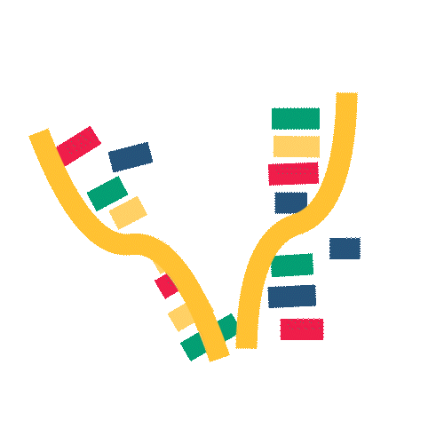
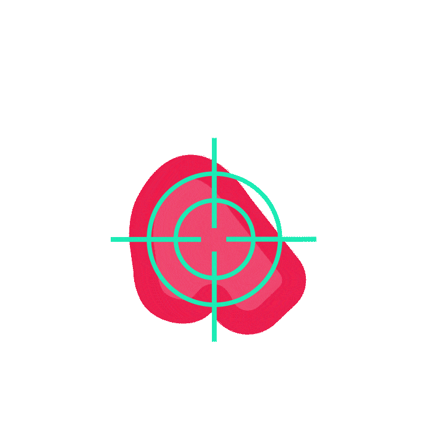
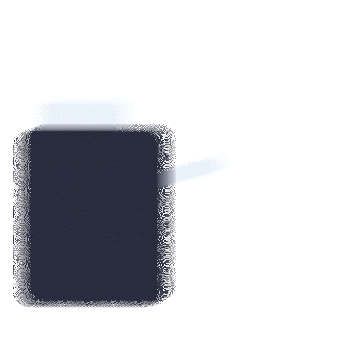

+++
title = "Radiopharmaceutical Therapy"
description = "A current look at the effects of Radiopharmaceutical therapy on cancer."
date = 2023-04-18
draft = false

[taxonomies]
categories = ["Science"]
tags = ["Science"]
[extra]
toc = true
keywords = "RPT, Radiopharmaceutical Therapy, Cancer therapy, Radiopharmaceuticals"
+++
## Introduction
Radiopharmaceutical therapy also known as RPTs, is a novel way to treat a horrific disease: cancer. Based on a technology that has been around for 90 years, nuclear medicine are now becoming full-on cancer treatments. Radiopharmaceuticals provide a way for cancer specialists, oncologists, to target cancer cells directly with radiation. This targeted radiation is both more accurate and less damaging to the patient. RPTs use the bodies’ natural processes to target cancer, giving greater accuracy and reliability.

## Meet Cancer
Cancer is one of the most dangerous pathogens known to man, yet it arises from our own bodies. Cells contain DNA, the building block of life, which contain instructions on how to grow, produce and die. To create new cells DNA must be copied, though this process can go awry. One C could turn into a G, leading to a new cell. When the process leads to a cell that is an annoyance for the body, there are usually safeguards: apoptosis, programmed death or the immune system. Though just the right mutation can create a cancer, which evades the safeguards and begins to grow rapidly. This rapid growth needs a lot of resources, which cannibalises the resources for regular body cells, slowly killing the host - us. Despite significant research effort and funding, full cancer treatment is a lofty goal, and RPTs have the potential to treat cancer once and for all.

    

        
        
Broken DNA

    

    

        
         
        
Uncontrolled growth

    

    

        
         
        
Ineffective safeguards

    

## Alternatives
To combat cancer, scientists and oncologists have developed a range of cancer treatments. The two most common cancer treatments are chemo and radiation therapy, which both kill body cells – causing long-term damage to the body and they need repeated treatments to full deal with the cancer, exposing the patient to trauma. Chemo and radiation therapy don’t work well on large clumps of cancer, as the medication cannot infiltrate it. 
 
 

    

        
        
<b>Chemotherapy</b>

    

    

        

        Chemotherapy is the use of powerful drugs that target and kill rapidly dividing cancer cells. These drugs can be administered orally or intravenously and are designed to kill cancer cells by disrupting their DNA or by preventing them from dividing and multiplying. While chemotherapy is highly effective at killing cancer cells, it can also damage healthy cells in the body, leading to a range of side effects. These side effects can include fatigue, nausea, hair loss, and increased susceptibility to infection.
        

    

 
 

    

        
        
<b>Radiation therapy</b>

    

    

        

        Radiation therapy, on the other hand, uses high-energy radiation to destroy cancer cells. This can be done using external radiation, where a machine directs a beam of radiation at the tumour from outside the body, or internal radiation, where radioactive material is implanted directly into the tumour. Like chemotherapy, radiation therapy can also damage healthy cells in the body, leading to side effects such as fatigue, skin irritation, and nausea.
        

    

## Radiopharmaceuticals

    

        
        
<b>Radiopharmaceutical therapy</b>

    

    

        

            Radiopharmaceuticals are a class of drug which harness radiation's ability to disrupt and destroy cells. As radiation destroys DNA, killing the cancer cells through inhibiting cell maintenance. To target the cancer cells, RPTs use biological targeting. They either target specific protein intake or protein receptors, with these targets they are able to trick a cancer cell into getting a concentrated dose of radiation. As only cancer cells exhibit these characteristics (targets) of strong growth, reproduction and repair; RPTs are able to successfully target them without effecting body cells.
        

    

### The Science

    

        
    

 

Radiopharmaceuticals are a way to combat both the issues with these medications, RPTs can use biological processes, like antibodies, to deliver radiation straight to the cancer. This radiation damages the DNA of cancer so severely that it cannot replicate and dies. As radiation is an electromagnetic wave it can pass through the cells killing cancer around the original targeted cell. This means that RPTs are even more effective on large clumps of cancer, so they can be used fittingly in the late states of cancer. RPTs have been described as “radioactive chemotherapy” as it has the benefits of both therapies. RPTs usually have a half-life of 1 hour so the radiation doesn’t stay in the body for too long. This means that RPTs need to be produced right before use. 

 

{{  img(src="./img/components.png" alt="A diagram of the components of RPTs, the targeting and radioactive agents which target a specific part of a cancer cell" w=540 h=405)  }}

## Benefits

    

        
        
Effective

    

    

        
         
        
Cost effective

    

    

        
         
        
Self evaluating

    

    

        
        
Safe

    

    

        
         
        
Quick

    

    

        
         
        
Knowledge base

    

#### Effective
You may be asking yourself where does radiation come into the picture? Well, with radiation, <abbr title="a doctor who specialises in cancer">oncologists</abbr> can actively disrupt cancer cells. As cancer cells cannot commit apoptosis, controlled death, they have to be forcefully killed. Radiation targets the DNA within the cells, destroying it to such a degree that the cell cannot grow nor replicate - effectively stopping cancer function. Compared to its radiation therapy brethren, RPTs are able to target large clusters of cells. As they target the cells on their outside, with one directional radiation. This does mean that RPTs are less effective at targeting singular cells, due to the inherent randomness in the radiation path, though is counteracted by the fact it can work effectively in clusters of singular cells, achieving effective treatment.

#### Cost effective
The products that make up radiopharmaceuticals themselves are relatively cheap, as the component products are readily available due to their already high use in the nuclear medicine space.

#### Self evaluating
Arguably the biggest benefit of RPTs are the ability to see in **real time** the effectiveness of the treatment, this means you can tell on the day of the treatment whether another round is needed. This reduces the managerial burden and suffering for patients as treatments can be planned ahead for maximum quality of life.

This benefit all stems from RPTs evolution from nuclear medicine, a technology that has been around for 90 years! Nuclear medicine is like RPTs, that radiation is delivered to specific cells based on targeting agents. Instead of killing the cells, the radiation is used to image where the cells are. All this means that by either being placed in a SPECT or PET machine, the oncologist can actively monitor your treatment, see if it is working, if there are more outbreaks and plan future doses. This is by far RPT's biggest strength as they provide real-time, personalised information on treatment success. This can benefit patient outcomes and overall wellbeing.

If the cancer were to evolve, the oncologist would be able to tell in real-time that the cancer is not responding to the medicine. They would then be able to adapt to this for the next treatment, this means higher accuracy and lower costs.

#### Safe
Radiopharmaceuticals are specifically designed to interface with only one type of cancer, through a biological linking device such as an antibody or a molecule which targets a unique protein function. As they are biological in nature, they can be easily adapted to counter the ever evolving cancer. This specific interface increases accuracy as it is less likely to connect with a body cell.

#### Quick
Compared to chemotherapy, RPTs are far quicker as they rely less on biological mechanisms to <u>transport</u> the medication. They are able to be injected to the closest point to the cancer, established by nuclear medicine. This means that RPTs are able to quickly travel to target sites and treat the cancer. While chemotherapy can become a laborious process for the patient. As it requires heavy modelling to understand the biological delivery mechanisms, giving a low success rate of only 3%[^1].

#### Knowledge base
As RPTs are closely linked to radiation therapy, the 90 years of progress on radiation therapy can carry over into the RPT ecosystem. This means that when RPT development starts to ramp up, all this pre-existing knowledge can be transferred over to make quick progress in RPT development. This also means that there is pre-existing infrastructure to deal with the complex and nuanced nature of RPTs. There is infrastructure to safely create, store and manage radioactive components within hospitals.

 

Compared to both radiation therapy and chemotherapy, RPTs are the clear winner. In contrast to radiation therapy, RPTs are able to target large clusters of cells - effectively targeting late stages of cancer. While compared to chemotherapy, RPTs are more effective at quickly seeking and targeting cancer. All of these factors, improve cancer patient outcomes by increasing efficiency, wellbeing and reliability.

 
## Limitations

    

        
        
Administration

    

    

        
         
        
Cost

    

    

        
         
        
Public stigma

    

    

        
        
Research

    

#### Administration
There is a lot administration needed to keep a **radioactive** product going to patients. There are concerns on radiation management and safety. There needs to be new procedures developed to manage RPTs. To create RPTs, expensive machinery has to be used. As the machinery is complex, people have to be trained on how to control the machines.

#### Cost
RPTs need costly equipment, they require cyclotrons, rare radio isotopes and SPECT imaging machines. Giving costs of the tens of millions for equipment alone, this means it can be unreachable for developing countries and their healthcare system. Creating a healthcare disparity within the global cancer treatment system.

#### Public stigma
With any radiation based treatment, there is an inherent negative stigma for these sort of products. Radiation is a scary concept for many and the idea of radiation being inside you can seem even scarer. Education is needed to encourage positive outlooks upon RPTs and to reiterate its benefits.

#### Research
There needs to be a lot more research before RPTs are able to be used in general medical practise. Even though they come with 90 years of history, we are only now understanding how they interact with the body especially from inside. Think of all the things that have to go right: the <u>targeting agent</u> has to be designed to only target the cancer cell, be able to be produced in large quantities — accurately and be able to adapt to the changing nature of cancer. The <u>linker</u> has to be able to hold onto the radioactive agent tight enough so it doesn't get loose in the body but loose enough so it easily detaches. Then the <u>radioactive agent</u> has to have a long enough half-life that it can be produced and injected into the body. Though short enough so that it cannot cause havoc within the body. The radioactive agent has to be readily available, be neither too strong or weak and be able to be focus fired at the cancer cell. There has to be a lot of research done to get RPTs right the first time, with dedicated teams using time and money to create a medicine that could save the lives of millions. 

 

RPTs do come with some inherent limitations. There is a negative stigma associated with radiation and especially ingested radiation, impacting RPT development. RPTs are complex to manufacture and have a short half-life, requiring hospitals to make them on site. They will need a large upfront investment to purchase all the equipment. RPTs are complex to design, requiring oncologists to consider all interactions with the body. RPTs have administrative issues as they are radioactive and need special bureaucratic procedures. 

 
## Implications
Radiopharmaceutical therapy has the potential to revolutionise our current cancer treatment. Due to its unique ability to quickly and accurately target individual cells with directed potent doses of radiation. One study concluded that it led to an 80% reduction in cancer related deaths!

Compared to radiation and chemotherapy, it is better for the patient as it has a shorter treatment duration, higher accuracy and more individualised treatment. It also is a safer treatment, as it is neither directing powerful radiation through the patient's body or relying solely on biological pathways.

 
## Current state
The elephant in the room is why RPTs have yet to be introduced into any standard cancer treatment. The main drawback is the complexity, there are a lot of moving parts to get RPTs to work. You have to get radioactive isotopes, bind it to the correct targeting agent, set the patient up under a SPECT machine all in the span of just an hour. Then the research has to be developed to support this sort of infrastructure: oncologists and radiologists need to work together to create a truly cohesive product. It has to be certified and regulated by a new government authority to maintain standards. There needs to be more funding and research to purchase the equipment and train the personnel needed to accelerate the field for the 21st century.

Radiopharmaceutical therapy has the potential to revolutionise our world as they provide doctors a novel and effective way to treat cancer in the 21st century.

[^1]: Within clinical trials for chemotherapy

_Though I make every effort to try supply accurate information and terminology, I am no means a trained medical professional in any capacity. Data current as of September 2022._

_Artistic license has been taken with the GIFs._

<header>
    <nav>
        <ul>
            <li><a href="./bibliography/">Bibliography 📚 &#62;</a></li>
        </ul>
    </nav>
</header>

{{ img(src="./img/end.gif" alt="A final image showing RPTs in action" w=1920 h=1080) }}