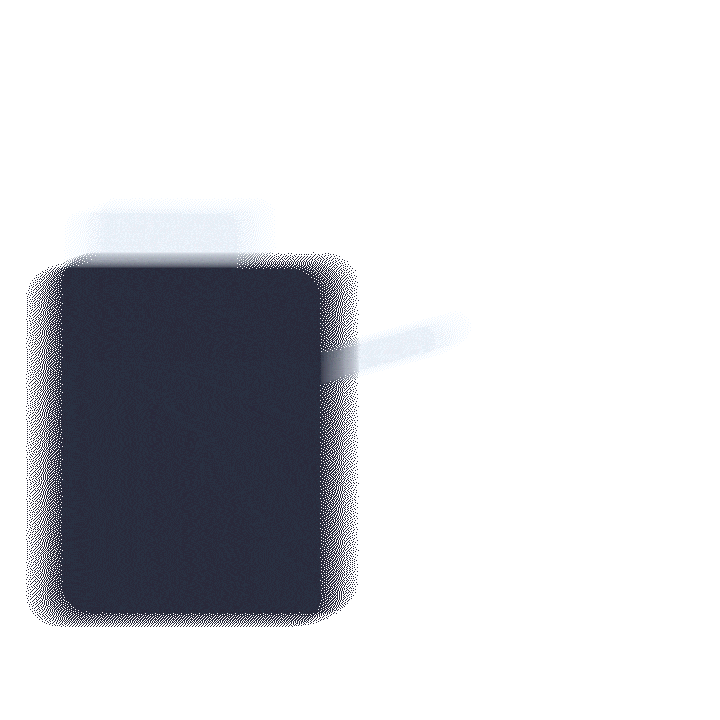

+++
title = "Radiopharmaceutical Therapy"
description = "A current look at the effects of Radiopharmaceutical therapy on cancer."
date = 2023-04-04
draft = false

[taxonomies]
categories = ["Science"]
tags = ["Science"]
[extra]
toc = true
keywords = "RPT, Radiopharmaceutical Therapy, Cancer therapy, Radiopharmaceuticals"
+++
## Introduction
Radiopharmaceutical therapy also known as RPTs, is a novel way to treat a horrific disease – cancer. Being around for more than 80 years, radiotracers, radioactive cancer indicators, are coming into the modern age with their evolution into cancer treatment. There is a currently a cancer in disguise behind me, do you think you can spot it? Radiopharmaceuticals provide a way for cancer specialists, oncologists, to target cancer cells directly with radiation. This targeted radiation is both more accurate and less damaging to the patient. RPTs use the bodies’ natural processes like biological delivery mechanisms, to target cancer. Did you see the cancer? Imagine now if you were trying to build medication for cancer, and now can you see the difficulty in treating cancer? 

## Meet Cancer
Cancer is a complex and devastating disease that arises from the uncontrolled growth and proliferation of abnormal cells in the body. The normal function of cells in the body is to divide and replace damaged or worn-out tissues, but in the case of cancer, this process goes awry. Cancer cells divide and replicate rapidly, often much faster than healthy cells, leading to the formation of tumours or abnormal masses of tissue. Additionally, cancer cells may mutate and develop abnormalities in their DNA, preventing the cell from repairing itself or from undergoing programmed cell death, known as apoptosis.

The inability of cancer cells to undergo apoptosis or programmed cell death means that they can continue to proliferate unchecked, consuming the body's resources and leading to the development of more and more abnormal cells. As the cancer cells grow and spread, they can damage healthy tissues and organs in the body, leading to a range of symptoms and complications. Over time, if left untreated, cancer can be fatal, as the cancer cells can overwhelm the body's natural defences and ultimately lead to organ failure. Despite significant advances in cancer treatment and research, cancer remains a significant health challenge, and ongoing efforts are focused on developing new therapies and strategies to combat this disease.

    

        
        
Broken DNA

    

    

        
         
        
Uncontrolled growth

    

    

        
         
        
Ineffective safeguards

    

## Alternatives
To combat cancer, scientists and oncologists have developed a range of cancer treatments. The two most common cancer treatments: chemo and radiation therapy, both kill human cells – causing long-term damage to the body and exposing the patient to trauma due to the repetitive treatment. Chemo and radiation therapy don’t work well on large clumps of cancer, as the medication cannot infiltrate it. 
 
 

    

        
        
<b>Chemotherapy</b>

    

    

        

        Chemotherapy involves the use of powerful drugs that target and kill rapidly dividing cancer cells. These drugs can be administered orally or intravenously and are designed to kill cancer cells by disrupting their DNA or by preventing them from dividing and multiplying. While chemotherapy is highly effective at killing cancer cells, it can also damage healthy cells in the body, leading to a range of side effects. These side effects can include fatigue, nausea, hair loss, and increased susceptibility to infection.
        

    

 
 

    

        
        
<b>Radiation therapy</b>

    

    

        

        Radiation therapy, on the other hand, uses high-energy radiation to destroy cancer cells. This can be done using external radiation, where a machine directs a beam of radiation at the tumor from outside the body, or internal radiation, where radioactive material is implanted directly into the tumor. Like chemotherapy, radiation therapy can also damage healthy cells in the body, leading to side effects such as fatigue, skin irritation, and nausea.
        

    

## Radiopharmaceuticals

    

        
        
<b>Radiopharmaceutical therapy</b>

    

    

        

            Radiopharmaceuticals are a class of drug which harness radiation's ability to disrupt and destroy cells as radiation destroy DNA which kills the cancer cells by inhibiting growth, upkeep and reproduction. To target the cancer cells, RPTs use biological targets either specific protein intake or specific protein receptors to trick a cancer cell to get concentrated dose of radiation. As only cancer cells exhibit these characteristics of strong growth, reproduction and repair; RPTs are able to successfully target them without effecting body cells.
        

    

### The Science

    

        
    

 

Radiopharmaceuticals are a way to combat both the issues with these medications, RPTs can use biological processes, like antibodies, to deliver radiation straight to the cancer. This radiation damages the DNA of cancer so severely that it cannot replicate and dies. As radiation is an electromagnetic wave it can pass through the cells killing cancer around the original targeted cell. This means that RPTs are even more effective on large clumps of cancer, so they can be used fittingly in the late states of cancer. RPTs have been described as “radioactive chemotherapy” as it has the benefits of both therapies. RPTs usually have half-lives of 1 hour so the radiation doesn’t stay in the body for too long, meaning that RPTs need to be produced right before use. 

 

{{  img(src="./img/components.png" alt="A diagram of the components of RPTs, the targeting and radioactive agents which target a specific part of a cancer cell" w=540 h=405)  }}

## Benefits

    

        
        
Effective

    

    

        
         
        
Cost effective

    

    

        
         
        
Self evaluating

    

    

        
        
Safe

    

    

        
         
        
Quick

    

    

        
         
        
Knowledge base

    

#### Effective
You may be asking yourself were does radiation come into this picture? Well, with radiation, <abbr title="a doctor who specialises in cancer">oncologists</abbr> can actively disrupt cancer cells. As cancer cells cannot commit apoptosis, controlled death, they have to be forcefully be killed. Radiation targets the DNA within the cells, destroying it to such a degree that the cell cannot grow nor replicate - effectively stopping cancer function. Compared to its radiation therapt brethren, RPTs are able to target large clusters of cells. As they target the cells on their outside, with unidirectional radiation. This does mean that RPTs are less effective at targetting singular cells, due to the inherent randomness in the radiation path, though is counteracted by the fact it can work effectively in clusters of singular cells, achieving treatment.

#### Cost effective
The products that make up radiopharmaceuticals themselves are relatively cheap, as the component products are readily available due to their already high use in the nuclear medicine space.

#### Self evaluating
Arguably the biggest benefit of RPTs are the ability to see in **real time** the effectiveness of the treatment, this mean you can tell on the day of the treatment whether another treatment is needed. This reduces the managerial burden and suffering for patients as treatments can be planned ahead for maximum quality of life.

This benefit all stems from RPTs evolution from nuclear medicine, a technology that has been around for 90 years! All this means that by either being placed in a SPECT or PET machine, the oncologist can actively monitor your treatment, see if it is working, if there are more outbreaks and plan future doses. This is by far RPT's biggest strength as they provide real-time, personalised information on treatment success. This can overall benefit patient outcomes and wellbeing.

If were the cancer were to 'evolve' per se, the oncologist would be able to tell in real-time that cancer is not responding to the patient. They would then be able to adapt this for the next treatment.

#### Safe
Radiopharmaceuticals are specifically designed to interface with only one type of cancer, through a biological linking device such as an antibody or a molecule as they are biological in nature, they can be adapted to the ever evolving cancer. This specific interface increases accuracy as it is less likely to connect with a body cell.

#### Quick
Compared to chemotherapy, RPTs are far quicker as they rely less on biological mechanism to <u>transport</u> the medication, instead they go straight to the cancer environment determined by nuclear imaging through intravenous methods. This means that RPTs are able to quickly travel to target sites and treat the cancer. While chemotherapy can become a laborious process for the patient. Chemotherapy requires heavy modelling to understand the biological delivery mechanisms, this means that they only have success rate of targeted biological agents within clinical trials is only 3%!   

#### Knowledge base
As established RPTs are closely linked to their radiation therapy cousins, with the 90 years of progress on radiation therapy this work can carry over into the RPT ecosystem. This means that when RPT development starts to ramp up, all this pre-existing knowledge can be transferred over to make quick progress on RPT development. This also means that there is pre-existing infrastructure to deal with the complex and nuanced nature of RPT, there is also infrastructure to safely create, store and manage radioactive components within hospitals.

 

Compared to both radiation therapy and chemotherapy, RPTs are the clear winner. In contrast to radiation therapy, RPTs are able to target large clusters of cells - effectively targeting late stages of cancer. While compared to chemotherapy, RPTs are more effective at quickly seeking and targetting cancer. All of these factors, improve cancer patient outcomes by increasing efficiency, wellbeing and reliability.

 
## Limitations

    

        
        
Administration

    

    

        
         
        
Cost

    

    

        
         
        
Public stigma

    

    

        
        
Research

    

#### Administration
There is a lot administration needed to keep a **radioactive** product going to patients. There are concerns on radiation management and safety. There needs to be new procedures developed to manage RPTs. To create RPTs, expensive machinery has to be used, as it is complex: people have to be trained on the machines to control them.

#### Cost
RPTs do need costly equipment, they require cyclotrons, rare radio isotopes and SPECT imaging machines. Giving costs of the tens of millions for equipment alone, this means it can be unreachable for developing countries and their healthcare system. This creates a healthcare disparity within the global cancer treatment system.

#### Public stigma
With any radiation based treatment, there is an inherent negative stigma for these sort of products. Radiation is a scary concept for many people and the idea of radiation being inside you can seem even scarer. Education is needed to encourage positive outlooks upon RPTs and to encourage its benefits.

#### Research
There needs to be a lot more research before RPTs are able to be used in the general medical practise. Even though they come with 90 years of history, we are only now understanding how they interact with the body especially from inside. Think of all the things that have to go right: the <u>targeting agent</u> has to be designed to only target the cancer cell, be able to be produced in large quantities — accurately and be able to adapt to the changing nature of cancer. The <u>linker</u> has to be able to hold onto the radioactive agent tight enough so it doesn't get loose in the body but loose enough so it easily detaches. Then the <u>radioactive agent</u> has to have a long enough half-life that it can be produced and injected into the body quickly though short enough so it does not cause havoc within the body. This radioactive agent has to be readily available, be neither too strong or weak and be able to be focus fired at the cancer cell. There has to be a lot of research done to get RPTs right the first time, with dedicated teams with time and effort, a medicine that could save the lives of millions could be produced. 

 

RPTs do come with some inherent limitations. There is a negative stigma associated with radiation and especially ingested radiation, impacting RPT development. RPTs are complex to manufacture, requiring hospitals to make them on site due to their short half-life. They need a large upfront investment as they require particle accelerators. RPTs are also complex to design, requiring oncologists to consider all interactions with the body.  RPTs have administrative issues as they are radioactive and need special bureaucratic procedures. 

 
## Implications
Radiopharmaceutical therapy has the potential to revolutionise our current cancer treatment. Due to its unique ability to quickly and accurately target individual cells with directed, potent doses of radiation. One study concluded that it led to an 80% reduction in cancer related deaths!

Compared to radiation and chemotherapy, it is better for the patient with the shorter duration, lower pain and more individualised treatment. It also is a safer treatment as it neither directing powerful radiation through the patient or relying solely on biological pathways we do not know much about.

 
## Current state
The burning question in the room is why RPT have yet to be introduced into any standard cancer treatment. The main drawback is the complexity, there are a lot of moving parts to get RPT to work. You have to get radioactive isotopes, bind it to the correct targeting agent, set the patient up under a SPECT machine all in the span of just an hour. Then the research has to be developed to support this sort of infrastructure: oncologists and radiologists need to work together to create a truly cohesive product. There needs to be more funding and research to purchase the equipment and train the personnel needed to accelerate the field for the 21st century.

Radiopharmaceutical therapy has the potential to revolutionise our world as they provide doctors a novel and effective way to treat cancer in 21st century.

_Though I make every effort to try supply accurate information and terminology, I am no means a trained medical professional in any capacity. Data current as of September 2022._

_Artistic license has been taken with the GIFs._

<header>
    <nav>
        <ul>
            <li><a href="./bibliography/">Bibliography 📚 &#62;</a></li>
        </ul>
    </nav>
</header>

{{ img(src="./img/end.gif" alt="A final image showing RPTs in action" w=1920 h=1080) }}